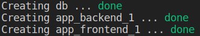
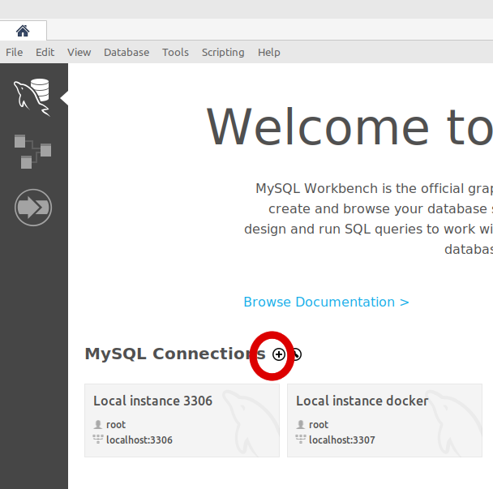
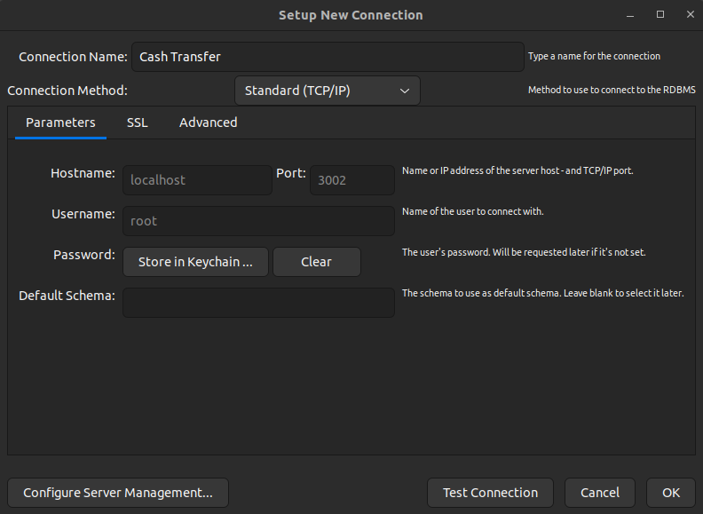
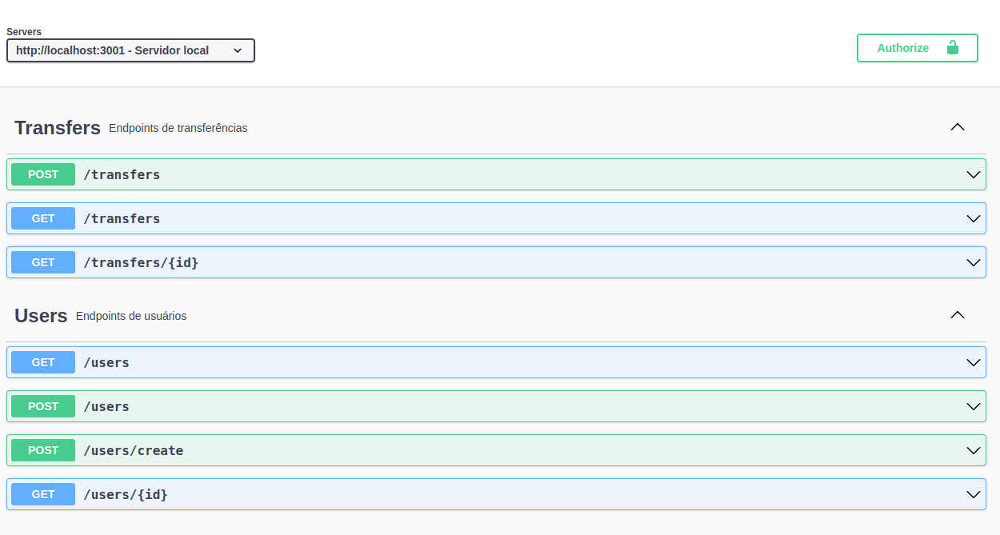
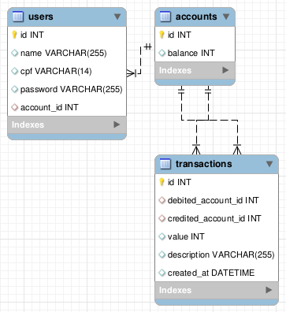

# Seja bem vindo ao projeto Cash Transfer!

## Stack utilizada

<strong>Front-end</strong>

- React JS;
- Tailwind

<strong>Back-end</strong>

- NodeJs;
- Express;
- Sequelize;

<strong>Testes</strong>

- Mocha, Chai e Sinon;
- RTL (React Testing Library);

<strong>Banco de dados</strong>

- MySQL;

<strong>Aplicação Conteinerizada</strong>

- Docker;

### Desenvolvimento

  
<strong>👨‍💻 O que foi desenvolvido</strong>

O `Cash Transfer` é um site para fazermos transferências de dinheiro entre contas!

1. Foi desenvolvido o `Cash Transfer`, onde fiquei responsável por desenvolver uma API e também integrar as aplicações para que elas funcionem consumindo um banco de dados.

2. Pude também implementar com que o front-end consumisse essa API, fazendo as requisições via `AXIOS`.

- Cadastro de novos usuários;
- Para fazer transações entre contas cadastradas no site;
- Atualização de saldo assim que a transação concluída;

3. Em andamento:

- Retirar extrato das últimas transações;
- Fale conosco;
- Notificações de transações

Nesse projeto, eu construi **uma aplicação dockerizado utilizando modelagem de dados através do Sequelize**. A API é consumida pelo front-end.

Temos a opção fazer diversas transações com muita facilidade.

 

<strong> Estrutura do projeto</strong>
 

O projeto é composto de 4 entidades importantes na sua estrutura:

1️⃣ **Banco de dados:**

- Container docker MySQL configurado no docker-compose através de um serviço definido como `db`.
- Tem o papel de fornecer dados para o serviço de _backend_.
- Durante a execução dos testes sempre vai ser acessado pelo `sequelize` e via porta `3002` do `localhost`;
- Você também pode conectar a um Cliente MySQL (Workbench, Beekeeper, DBeaver e etc), colocando as credenciais configuradas no docker-compose no serviço `db`.
- Adicionei um arquivo no local `/app/backend/.env.example` para caso você queira rodar o banco de dados localmente, basta renomea-lo para .env e as váriaveis de ambiente já estão configuradas ao docker.

2️⃣ **Back-end:**

- Ele roda na porta `3001`, pois o front-end faz requisições para ele nessa porta por padrão;
- Sua aplicação é inicializada a partir do arquivo `app/backend/src/app.js`;
- Ela garanta que o `express` é executado e a aplicação ouve a porta que vem das variáveis de ambiente;

3️⃣ **Front-end:**

- O front se comunica com serviço de back-end pela url `http://localhost:3001` através dos endpoints que foi construído.

4️⃣ **Docker:**

- O `docker-compose` une todos os serviços conteinerizados (backend, frontend e db) e sobe o projeto completo com o comando `npm run compose:up`;

<strong>🕵️ Linter</strong>
 

Para garantir a qualidade do código, usei o [ESLint](https://eslint.org/) para fazer a sua análise estática.

Você também pode instalar o plugin do `ESLint` no `VSCode`: bastar ir em extensions e baixar o [plugin `ESLint`](https://marketplace.visualstudio.com/items?itemName=dbaeumer.vscode-eslint).

<strong> ⚠️ Configurações mínimas para execução do projeto</strong>
 

Na sua máquina você deve ter:

- Sistema Operacional Distribuição Unix
- Node versão 16
- Docker
- Docker-compose versão >=1.29.2

➡️ O `node` deve ter versão igual ou superior à `16.15.0 LTS`:

- Para instalar o nvm, [acesse esse link](https://github.com/nvm-sh/nvm#installing-and-updating);
- Rode os comandos abaixo para instalar a versão correta de `node` e usá-la:
  - `nvm install 16 --lts`
  - `nvm use 16`
  - `nvm alias default 16`

➡️ O`docker-compose` deve ter versão igual ou superior à`ˆ1.29.2`:

# Orientações

  
<strong>🐋 Rodando no Docker</strong>

  
  ## 👉 Com Docker
    ### Docker e Docker-compose

⚠ O seu docker-compose precisa estar na versão 1.29 ou superior. ⚠
[Veja aqui a documentação para atualizar o docker-compose.](https://docs.docker.com/compose/install/)

- Para rodar o projeto por completo, basta digitar o código em seu terminal `npm run compose:up`;

<strong> ⚠️ Inicialização do compose e verificação dos logs das aplicações </strong>
 

- Considerando o uso do parâmetro `healthcheck` em cada container do seu `docker-compose.yml`, a inicialização dos containers deve aguardar o comando de status de saúde (o que valida se aquele container está operacional ou não):

  - No container `db`, representado por um comando `ping` no banco de dados;
  - No back-end, representado por um comando `lsof`, que vai procurar aplicações ativas na porta definida (por padrão, no caso `3001`);
  - No front-end, representado por um comando `lsof`, que vai procurar aplicações ativas na porta definida (por padrão, no caso `3000`).

- Caso os containers respeitem as premissas anteriores, os mesmos devem ser criados sem maiores problemas:

- Em caso de algum problema (no back-end, por exemplo), você deve se deparar com alguma mensagem do tipo:

**VERIFIQUE OS LOGS DO DOCKER PARA SABER O QUE HOUVE DE INCORRETO NA INICIALIZAÇÃO DO DOCKER**

  
<strong>Rodando somente o BANCO MYSQL com Docker</strong>

  
  ## 👉 Com Docker instalado
  - Rode este comando no terminal
    `docker run -dit --name dockerSQL -e MYSQL_ROOT_PASSWORD=123456 -v ~/mysql_data:/var/lib/mysql -p 3002:3306 mysql`
    
  - [Instale o Workbench](https://dev.mysql.com/downloads/workbench/)
  
  - Adicione uma nova conexão
  
  
  - Coloque as credenciais como refere a imagem abaixo e clique em Store in Keychain para colocar a senha que setamos do container MYSQL
  

- Para rodar o projeto por completo:
  - Abra dois terminais;
  - Entre na pasta /app
  - Rode em seu terminal `npm run start:backend` e no outro `npm run start:backend`;

<strong>Documentação da API</strong>
<br/ >
Utilizei a ferramenta Swagger para documentar toda a API que foi desenvolvida neste projeto
Você pode rodar ela juntamente com o projeto:
- Ao rodar a porta 3001, basta ir para o localhost acessando `http://localhost:3001/docs` e terá acesso a todos endpoints com seus respectivos retorno esperados.

  
<strong>🎲 Sequelize</strong>

   

Para o desenvolvimento, foi baseado no _Diagrama de Entidade-Relacionamento (DER)_ para construir a modelagem do banco de dados. Com essa imagem você já consegue saber:

- Os nome das tabelas e colunas;
- Os tipos de suas colunas;
- Relações entre tabelas.

  

<h1 style="center">Obrigado pela visita ao meu repositório</h1>

## 🔗 Links

